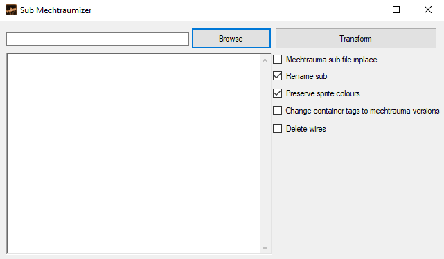

# Sub-Mechtraumazinator
Convert Barotrauma submarines to Mechtrauma submarines. 
## Prerequisutes
Microsoft .NET Framework 4.7.2
## Installation
### Building from source
*Recommended: Visual Studio 2022*
1. Open `Sub-Mechtraumazinator.sln`.
2. Change the solution configuration to `Release`.
3. Build the solution.
4. Run `Sub-Mechtraumazinator.exe`.
### Downloading a pre-compiled executable
1. Download either `Sub-Mechtraumazinator.zip` or `Sub-Mechtraumazinator.tar.xz` from [the latest release](https://github.com/Jlobblet/Sub-Wrecker/releases/latest). Both archives contain the same file - which you use is down to your preference.
2. Extract the files to whatever location you choose.
3. Run `Sub-Mechtraumazinator.exe`.
## Usage
Run `Sub-Mechtraumazinator.exe`.  

### Browse
Select one or more `.sub` files to wreck.
### Transform
Clicking this button will transform the selected files in accordance with the settings below.
#### Wreck file inplace
Instead of outputting to a new file, output to the same file as used for input.
#### Rename sub
Append `_Mechtrauma` to the name of the submarine
#### Preserve sprite colours
If unchecked, will reset all sprite colours of mehctrauma objects to `255,255,255,255`.
#### Change container tags to Mechtrauma versions
Replaces the tags on containers with mechtrauma versions, e.g. `junctionbox` becomes `electricalpanel` or `fusebox`. (Dont use for now)
#### Delete wires
If checked, deletes all wires on the submarine.
